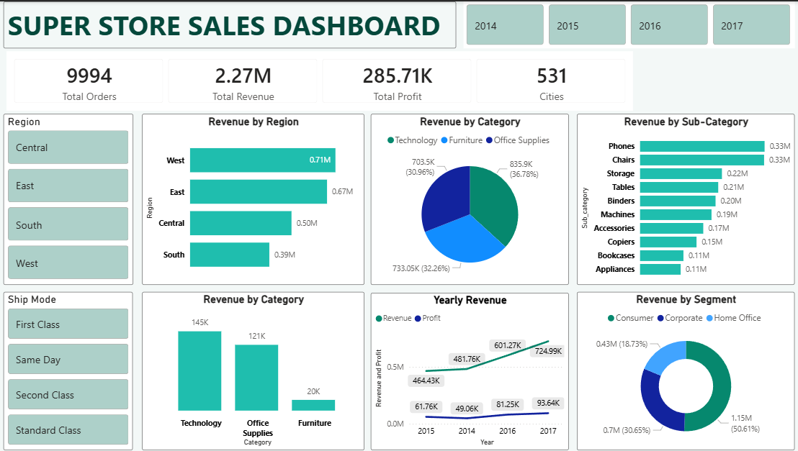

# 🛒 Super Store Sales Analytics

> End-to-end retail analytics pipeline — from raw CSV to interactive Power BI dashboard — built on Microsoft Fabric, PySpark, and SQL.



---

## 📌 Project Summary

| Metric | Value |
|---|---|
| Total Orders | 9,994 |
| Total Revenue | $2.27M |
| Total Profit | $285.71K |
| Cities Covered | 531 |

This project walks through a complete data analytics lifecycle: ingesting raw retail data, cleaning and transforming it with PySpark inside Microsoft Fabric, running business-focused SQL queries, and surfacing insights through an interactive Power BI dashboard.

---

## 🏗️ Pipeline Architecture

```
sales_raw.csv
      │
      ▼
┌─────────────────────┐
│  Microsoft Fabric   │  ← Lakehouse + Notebook environment
│  (Data Ingestion)   │
└────────┬────────────┘
         │
         ▼
┌─────────────────────┐
│  PySpark Notebook   │  ← Sales_notebook.ipynb
│  (Cleaning & EDA)   │     • Standardise column names
│                     │     • Fix date formats
│                     │     • Handle nulls & duplicates
└────────┬────────────┘
         │
         ▼
┌─────────────────────┐
│  SQL Endpoint       │  ← Sales.sql
│  (Analysis Layer)   │     • Revenue aggregations
│                     │     • Profit margin queries
│                     │     • Region / segment breakdowns
└────────┬────────────┘
         │
         ▼
┌─────────────────────┐
│  Power BI Dashboard │  ← Super Store Dashboard.pbix
│  (Visualisation)    │     • KPI cards, bar/pie/donut charts
│                     │     • Year, region, ship mode filters
└─────────────────────┘
```

---

## 🧰 Tech Stack

| Tool | Purpose |
|---|---|
| **Microsoft Fabric** | Lakehouse storage, Notebook runtime, SQL Endpoint |
| **PySpark** | Data cleaning and transformation |
| **SQL** | Business-level aggregations and analysis |
| **Power BI** | Interactive dashboard and KPI visualisation |
| **GitHub** | Version control and project hosting |

---

## 📁 Repository Structure

```
superstore-sales-analytics/
│
├── sales_raw.csv                  # Raw input dataset
├── Sales_notebook.ipynb           # PySpark cleaning & transformation notebook
├── Sales.sql                      # SQL queries for business analysis
├── Super Store Dashboard.pbix     # Power BI dashboard file
├── sales_dashboard.png            # Dashboard preview image
└── README.md                      # Project documentation
```

---

## 📊 Dashboard Features

**KPI Cards**
- Total Orders · Total Revenue · Total Profit · Cities Covered

**Charts & Visuals**
- Revenue by Region (horizontal bar chart)
- Revenue by Category — Technology, Office Supplies, Furniture (pie chart)
- Revenue by Sub-Category — top 10 sub-categories (bar chart)
- Revenue by Segment — Consumer, Corporate, Home Office (donut chart)
- Yearly Revenue & Profit Trend (2014–2017, dual-line chart)

**Interactive Filters**
- Region (Central / East / South / West)
- Ship Mode (First Class / Same Day / Second Class / Standard Class)
- Year (2014 / 2015 / 2016 / 2017)

---

## 🔍 Key Insights

- **West region** leads in revenue at **$0.71M**, followed closely by East at **$0.67M**
- **Technology** is the highest-grossing category ($145K orders volume), with **Phones and Chairs** topping sub-category revenue at $0.33M each
- **Revenue grew consistently** from $464K (2014) to $725K (2017), but **profit growth is slower** — indicating rising costs or discounting pressure
- **Consumer segment** dominates at **50.61% of total revenue**, more than Corporate and Home Office combined
- **Office Supplies** generates strong order volume (121K) despite lower per-unit margins

---

## ▶️ How to Use

1. **Explore the raw data** — open `sales_raw.csv` to understand the dataset structure (orders, customers, products, regions, dates)
2. **Run the notebook** — open `Sales_notebook.ipynb` in Microsoft Fabric or a PySpark-compatible environment to see the cleaning steps
3. **Query the data** — run `Sales.sql` against the cleaned dataset to reproduce the business analysis queries
4. **Open the dashboard** — load `Super Store Dashboard.pbix` in Power BI Desktop and use the slicers to explore by year, region, and ship mode

---

## 👨‍💻 Author

**Nihar Toor**
Aspiring Data Analyst · Delhi NCR

[](https://linkedin.com/in/nihartoor)
[](https://github.com/Niharricky)
[](https://niharricky.github.io/Portfolioweb/)
